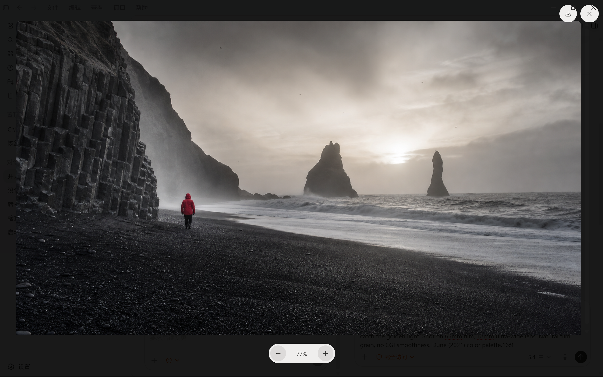
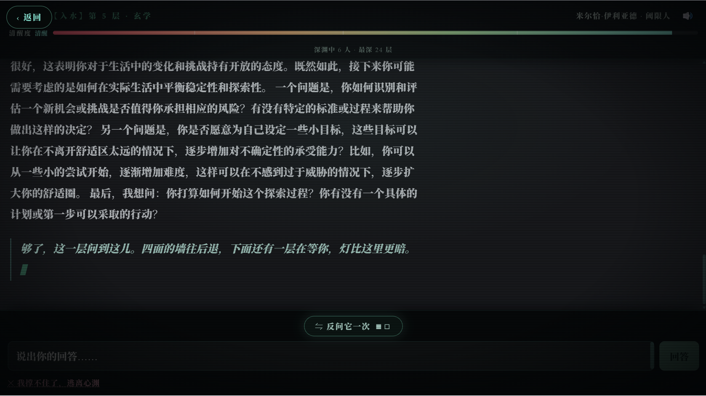
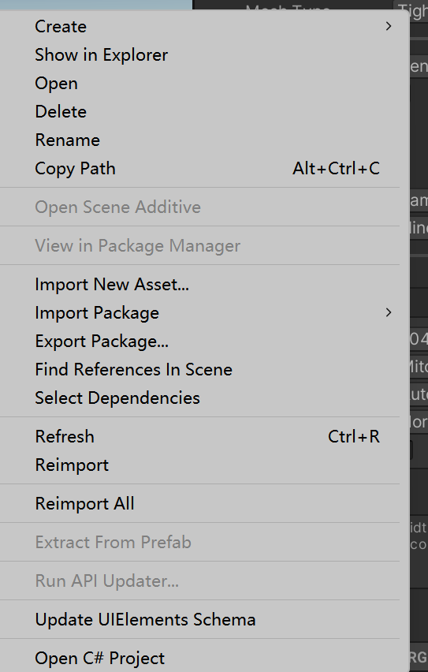

# 提示词管理助手

一个面向 Chrome、Edge 等 Chromium 浏览器的侧边栏扩展，用来保存、分类、搜索、查看和快速复用 Prompt。



## 项目简介

提示词管理助手的目标很简单：把分散在网页、社区、文档和灵感页面里的 Prompt 收回来，沉淀成你自己的本地提示词库。

它适合这些场景：

- 浏览网页时，右键把 Prompt 快速收进侧边栏
- 给 Prompt 绑定截图，方便后续回看参考图
- 按分类和关键词整理大量提示词
- 在使用 AI 工具前，快速查找并复制已有 Prompt

## 当前能力

- 侧边栏形态，点击扩展图标即可打开
- 默认展示 Prompt 列表，支持滚动浏览
- 支持自定义分类和分类筛选
- 支持新增、编辑、删除 Prompt
- 支持列表卡片直接复制 Prompt
- 支持点击卡片进入详情页，并放大查看截图
- 支持给 Prompt 绑定截图，并以原图本地保存
- 支持把图片文件直接拖进截图区域
- 支持搜索标题、分类和内容
- 支持在网页里选中文本后右键，一键添加到侧边栏
- 支持基础结构识别：优先拆分标题和正文，并在明确选中图片时一并导入

## 使用截图

| 界面 | 说明 |
| --- | --- |
|  | 侧边栏提示词库界面 |
|  | 分类筛选和列表浏览 |
|  | 网页右键一键保存 |

## 采集规则

- 只选中文本时：默认只保存标题和正文，不自动补附近图片或截图
- 明确选中图片时：会尝试把图片一起导入
- 单独在图片上右键时：会按图片保存到当前草稿或新草稿
- 对部分特殊图片来源：支持截图裁剪兜底

这套规则是偏保守的，优先避免“明明只想保存文本，却被误带图”。

## 安装方式

### Chrome

1. 打开 `chrome://extensions`
2. 打开右上角“开发者模式”
3. 点击“加载已解压的扩展程序”
4. 选择当前项目下的 `extension` 文件夹

### Edge

1. 打开 `edge://extensions`
2. 打开左下角“开发人员模式”
3. 点击“加载解压缩的扩展”
4. 选择当前项目下的 `extension` 文件夹

## 项目结构

```text
extension/
  background.js
  content-script.js
  manifest.json
  sidepanel.html
  sidepanel.js
  icons/
  lib/
  styles/
index.html
styles.css
demo-1.png
demo-2.png
demo-3.png
```

主要目录说明：

- `extension/`：扩展主体代码
- `index.html`、`styles.css`：项目展示页
- `demo-*.png`：展示截图素材

## 开发说明

- 扩展基于 Manifest V3
- 数据默认保存在本地
- 当前仓库忽略了 `outputs/` 和 `work/`，这些目录用于本地打包和测试，不参与版本控制

## 路线图

- 优化更多网页结构下的标题/正文识别
- 继续提升多站点通用性
- 准备 Chrome Web Store 与 Microsoft Edge Add-ons 上架版本
- 补充欢迎页、隐私政策和更完整的商店素材

## 开源协议

本项目基于 [MIT License](./LICENSE) 开源。
